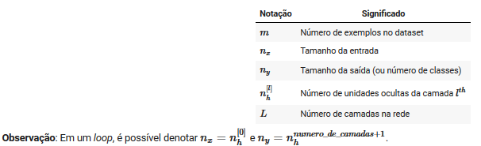
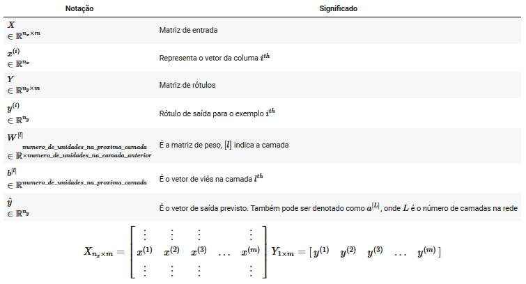
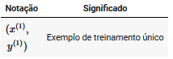

# Ordem
A jupyter notebooks por curso e semana.

- Neural Networks and Deep Learning
  - Neural Networks Basics (Week 2)
    - logistic_regression
    - vectorization
    - numpy_vectors
  - Shallow neural networks (Week 3)
  - Deep Neural Networks (Week 4)

# Notação
Notação matemática para deep learning.

## Tamanhos

## Objetos

## Outros

# Alguns links

- [Implementing a Neural Network from Scratch in Python – An Introduction](http://www.wildml.com/2015/09/implementing-a-neural-network-from-scratch/)
- [Why normalize images by subtracting dataset's image mean, instead of the current image mean in deep learning?](https://stats.stackexchange.com/questions/211436/why-normalize-images-by-subtracting-datasets-image-mean-instead-of-the-current)
- [The code of logistic regression](http://himarsh.org/the-code-of-logistic-regression/)